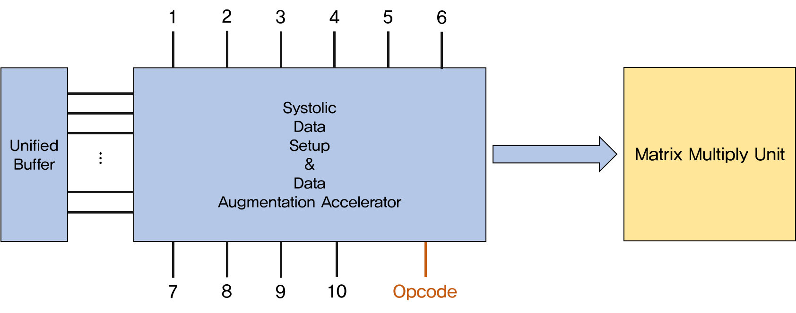
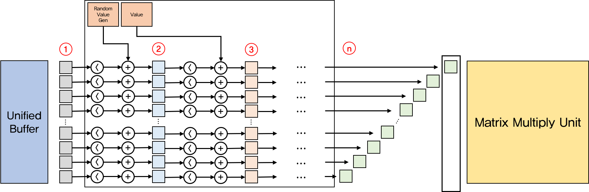

# Systolic-Array-Simulator

## Instruction

- RHM src dst N (N cycle)
  - Read N vectors from Host Memory to Unified Buffer

- WHM src dst N (N cycle)
  - Write N vectors from Unified Buffer to Host Memory

- RW.{U} addr N (N * N / 64 cycle)
  - Read N weight vectors from DRAM to Weight FIFO
  - U option means Unfold (convolution lowering)

- MMC.{SOU} src dst N (If MM, 2 * N -1 cycle. If conv, 2 * (weight_size + N – 1)^2 - 1)
  - Matrix Multiply / Convolution with N input vectors
  - S option means Switch (Switch MMU weight buffer)
  - O option means Overwrite (Overwrite result on accumulator)
  - U option means Unfold (convolution lowering)

- ACT.{FP} src dst N {M} (N cycle)
  - Activate N vectors (ReLU and something) and write to Unified Buffer (M is kernel matrix size)
  - F option means Fold (Fold unfolded result matrix)
  - P option means Pooling

- NOP

- HLT

## Augmentation Instruction Set

### Architecture

### Instruction & Descriptions

위에 있을수록 우선순위가 높음

- **Crop with resizing** (Nearest neighbor algorithm) (구현중)
  - MMC.{SOU} src dst N 0000000001 M K
  - src는 crop 시작 좌표
  - M은 가로 비율 (ceil(원래 이미지 가로 길이 / Crop 이미지 가로 길이))
  - K은 세로 비율 (ceil(원래 이미지 세로 길이 / Crop 이미지 세로 길이))
  - 구체적인 알고리즘
    1. 읽어올 Vector 좌표를 계산한다
       -  $src + \lfloor{\frac{i}{M}}\rfloor (0 \leq i < N)$
    2. Vector를 위아래로 늘린다
       -  $\lfloor{\frac{j}{K}}\rfloor (0 \leq j < sizeof(MMU))$

- **Flip left right**
  - MMC.{SOU} src dst N 0000000010
  - 구체적인 알고리즘
    - From (src + N) to src 순서로 읽어온다.

- **Translation right**
  - MMC.{SOU} src dst N 0000000100 start M
  - Start는 처음 읽기 시작할 주소
  - M은 start에서 시작해서 읽어올 vector의 수
  - 구체적인 알고리즘
    1. From start to start + M  순서로 읽고
    2. From src to (src + N - M) 순서로 읽는다.

- **Color distort**
  - MMC.{SOU} src dst N 0000001000 start end value
  - Start 좌표부터 End 좌표까지의 pixel에 value 값을 더한다
  - 구체적인 알고리즘
    - MMU로 내보낼 pixel의 좌표 값이 start와 end 사이에 있다면 value를 더해서 내보낸다.
    - Value 값이 음수인 경우 constant decrease이다.

- **Random color distort**
  - MMU.{SOU} src dst N 0000010000 start end range
  - Start 좌표부터 End 좌표까지의 pixel에 랜덤한 값(-range ~ +range)을 더한다
  - 구체적인 알고리즘
    - 랜덤 값을 -range ~ +range 범위에서 하나 뽑는다.
    - MMU로 내보낼 pixel의 좌표 값이 start와 end 사이에 있다면 랜덤값을 더해서 내보낸다.
    - 매번 새로운 random을 뽑아야 한다.

- **Random cutout** (구현중)
  - MMU.{SOU} src dst N 0000100000 M
  - M x M 크기의 random cutout 하나를 생성한다.
  - 구체적인 알고리즘
    - 랜덤으로 시작 좌표를 하다 뽑는다
    - MMU로 내보낼 pixel의 좌표 값이 시작 좌표 기준 M x M 박스 안에 있다면 0으로 만든다
  - 한계점
    - M x M 크기로 제한됨
    - 이미지가 잘려서 들어오는 경우, 잘려진 이미지를 아우르는 cutout을 만들 수 없음.

### Instruction Synthesis

Instruction을 조합하여 여러 augmentation을 동시에 적용할 수 있음

적용할 augmentation은 000000000 bit로 결정된다.

각 augmentation에 필요한 값들은 우선순위대로 MMU instruction 뒤에 붙는다.

예를 들어, Crop & Color distort & Random cutout을 조합한다고 하자.

이 경우 instruction은 

 - MMU.{SOU} src dst N 0000101001 M_crop K_crop start end value M_cut 

이 된다.

동작도 우선순위대로 일어난다.

Systolic setup은 vector 단위로 연산이 일어난다는 것을 유념하여 위 경우를 분석해보자. 

1. Crop and resize를 적용하여 잘려진 vector를 원래 사이즈로 늘린다
2. 늘려진 vector에 color distortion을 적용한다.
3. Random cutout을 적용한다.
  
최종적으로 만들어진 vector는 

- 잘려진 일부 이미지의 vector가 nearest neighbor 알고리즘에 의해 늘어났고
- 늘어난 상태에서 distortion을 적용받아 채도가 변했고
- 일부 pixel이 0이 되어있는 (아닐 수도 있음) 

vector이다.

#### Problem

이런 식으로 합성을 구현하면 조합하는 augmentation의 수에 비례하여 instruction이 너무 길어진다.

하지만 이외에 별 방법이 없다.
